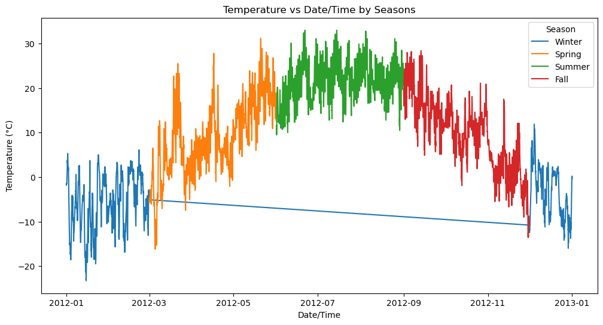
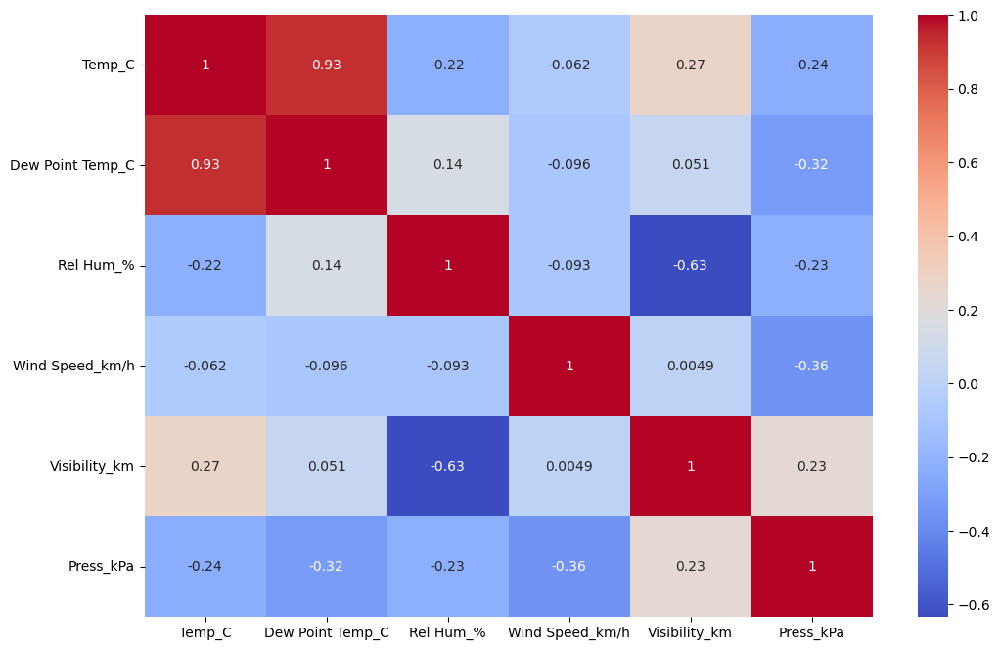

# 1. Data Overview and Cleaning
# Key Characteristics:

Dataset Size: The dataset contains 8,784 records (rows) and 8 features (columns).
Features: The dataset includes the following columns:
* Date/Time (object): The timestamp of the recorded weather data.
* Temp_C (float64): The temperature in degrees Celsius.
* Dew Point Temp_C (float64): The dew point temperature in degrees Celsius.
* Rel Hum_% (int64): The relative humidity as a percentage.
* Wind Speed_km/h (int64): The wind speed in kilometers per hour.
* Visibility_km (float64): The visibility distance in kilometers.
* Press_kPa (float64): The atmospheric pressure in kilopascals.
* Weather (object): The recorded weather conditions.

# Missing or Null Values:

There are no missing or null values in the dataset. All columns have 8,784 non-null entries. Since there are no missing values, no imputation or removal is necessary.

# Duplicate Records:

The dataset contains no duplicate records, as confirmed by the df.duplicated().sum() result showing 0 duplicates.
# 2. Statistical Summary
Numerical Features Summary:
The dataset consists of both integer and float data types, which are summarized statistically as follows:

Temperature (Temp_C):

Mean: 8.80°C
Standard Deviation: 11.69°C
Minimum: -23.3°C
Maximum: 33.0°C
Median (50th Percentile): 9.3°C

Dew Point Temperature (Dew Point Temp_C):

Mean: 2.56°C
Standard Deviation: 10.88°C
Minimum: -28.5°C
Maximum: 24.4°C
Median (50th Percentile): 3.3°C

Relative Humidity (Rel Hum_%):

Mean: 67.43%
Standard Deviation: 16.92%
Minimum: 18%
Maximum: 100%
Median (50th Percentile): 68%

Wind Speed (Wind Speed_km/h):

Mean: 14.95 km/h
Standard Deviation: 8.69 km/h
Minimum: 0 km/h
Maximum: 83 km/h
Median (50th Percentile): 13 km/h

Visibility (Visibility_km):

Mean: 27.66 km
Standard Deviation: 12.62 km
Minimum: 0.2 km
Maximum: 48.3 km
Median (50th Percentile): 25.0 km

Pressure (Press_kPa):

Mean: 101.05 kPa
Standard Deviation: 0.84 kPa
Minimum: 97.52 kPa
Maximum: 103.65 kPa
Median (50th Percentile): 101.07 kPa

# Outlier Detection:

Temperature (Temp_C):

The minimum temperature (-23.3°C) and maximum temperature (33.0°C) are significant deviations from the mean, indicating potential outliers.
Dew Point Temperature (Dew Point Temp_C):

The minimum (-28.5°C) and maximum (24.4°C) values for dew point temperature could be considered outliers due to their deviation from the mean.
Wind Speed (Wind Speed_km/h):

The maximum wind speed of 83 km/h stands out as a potential outlier, given the mean wind speed is 14.95 km/h.
Visibility (Visibility_km):

The minimum visibility of 0.2 km could indicate an outlier due to extreme weather conditions (e.g., heavy fog).
This statistical summary provides an initial understanding of the weather dataset, highlighting the central tendency and dispersion of key weather parameters. Outlier detection is crucial for identifying unusual weather events or data recording errors that may need further investigation.

# 3. DATA VISUALIZATION

The visualization provided displays three histograms representing the distributions of key weather parameters: Temperature (°C), Relative Humidity (%), and Wind Speed (km/h).

1. Temperature Distribution:
Range: The temperature ranges from approximately -25°C to 35°C.
Shape: The distribution is slightly skewed to the left, with the most frequent temperatures falling between 0°C and 10°C.
Mode: The highest frequency is observed around 0°C, indicating that temperatures close to freezing are most common in the dataset.
2. Humidity Distribution:
Range: The relative humidity values range from 20% to 100%.
Shape: The distribution is right-skewed, with a peak around 60% relative humidity, which is the most common value.
Mode: The highest frequency is seen at around 60%, suggesting that moderately humid conditions are predominant.
3. Wind Speed Distribution:
Range: Wind speed ranges from 0 km/h to about 83 km/h.
Shape: The distribution is heavily right-skewed, with the majority of wind speeds falling between 0 km/h and 20 km/h.
Mode: The most frequent wind speeds are in the range of 10-15 km/h, indicating that lower wind speeds are more common.

The visualization depicts the temperature trends across different seasons throughout the year 2012, highlighting notable patterns and seasonal variations:

Notable Patterns and Seasonal Variations:

Winter (Blue):

Temperatures during the winter months (January and December) are consistently low, often dipping below 0°C.
The temperatures exhibit significant fluctuations, indicating cold spells and possibly brief periods of warmer weather.

Spring (Orange):

A clear warming trend is evident as winter transitions into spring, with temperatures gradually rising from below 0°C to above 20°C.
The increase in temperature is relatively steady, reflecting the seasonal shift towards warmer weather.

Summer (Green):

Summer shows the highest temperatures, often exceeding 30°C, with frequent fluctuations around the 20°C to 30°C range.
This period is marked by stable and consistently warm conditions, characteristic of summer.

Fall (Red):

Fall displays a cooling trend, with temperatures gradually decreasing from summer highs back towards 0°C as winter approaches.
Similar to spring, fall exhibits a steady change in temperature, though in the opposite direction, reflecting the seasonal cooling.

# HEATMAP

The heatmap shows the correlation matrix between variables in the weather dataset.

1. Strong Positive Correlation:

Temperature (Temp_C) and Dew Point Temperature (Dew Point Temp_C): The correlation value is 0.93, indicating a strong positive relationship. As the temperature increases, the dew point temperature tends to increase as well.

2. Negative Correlations:

Relative Humidity (Rel Hum_%) and Visibility (Visibility_km): There is a negative correlation of -0.63, meaning that higher relative humidity is associated with lower visibility.
Temperature (Temp_C) and Relative Humidity (Rel Hum_%): The correlation is -0.22, suggesting that as the temperature increases, relative humidity tends to decrease, though this relationship is weaker.

3. Moderate Negative Correlation:

Pressure (Press_kPa) and Wind Speed (Wind Speed_km/h): The correlation is -0.36, indicating that higher wind speeds are generally associated with lower atmospheric pressure.
Pressure (Press_kPa) and Dew Point Temperature (Dew Point Temp_C): The correlation is -0.32, showing that when the pressure is higher, the dew point temperature tends to be lower.

4. Weaker or No Significant Correlation:

Wind Speed (Wind Speed_km/h) and Visibility (Visibility_km): The correlation is very close to zero (0.004), indicating little to no linear relationship between these variables.

# 4. Weather Patterns and Trends

 Seasonal and Monthly Variations:

* Temperature:

Winter: Temperatures during the winter months tend to be low, often dropping below freezing, as observed in the January and December data. This is consistent with the expected seasonal pattern of colder temperatures during winter.
Spring: There is a noticeable increase in temperature from March through May, marking the transition from winter to warmer spring weather.
Summer: The highest temperatures are observed during the summer months (June to August), with peaks reaching above 30°C. This aligns with the typical expectation of hotter temperatures during summer.
Fall: Temperatures begin to decline from September onwards as the transition from summer to fall occurs, with a gradual decrease leading back into winter.

* Humidity:

Seasonal Fluctuations: Humidity shows an inverse relationship with temperature. During the summer months, relative humidity tends to decrease as temperature increases. Conversely, during colder months, humidity levels are generally higher.
Monthly Trends: Humidity tends to be highest during the winter and fall months, possibly due to lower temperatures and reduced evaporation rates, while it is lower during the warmer summer months.

# Anomalies and Unusual Patterns:

* Temperature Drops:

There are occasional sharp drops in temperature that do not align with the overall seasonal trend, particularly in the transition periods between seasons. These could be attributed to sudden cold fronts or unusual weather patterns, such as polar vortex events.

* Visibility and Wind Speed:

Some periods exhibit unusually low visibility coupled with high wind speeds, which could indicate the presence of storms or foggy conditions. These anomalies are worth investigating further as they could be tied to specific weather events such as severe storms or fog episodes.

# 5. Insights and Conclusions

* Temperature and Dew Point Relationship:

A strong positive correlation between temperature and dew point suggests that warmer air holds more moisture, which is a well-known meteorological principle. This relationship is critical for understanding humidity levels and predicting fog or dew formation.

* Humidity and Visibility:

The negative correlation between humidity and visibility highlights how higher humidity often leads to reduced visibility, likely due to fog or precipitation. This insight is crucial for weather prediction, especially in forecasting conditions that could impact transportation and outdoor activities.

* Wind Speed and Pressure:

The moderate negative correlation between wind speed and atmospheric pressure suggests that stronger winds are often associated with low-pressure systems, which are typically associated with stormy weather. This finding can be useful in forecasting severe weather events.

# 6. Recommendations for Further Analysis
1. Detailed Seasonal Analysis:

A more deeper analysis of the data by dividing it into smaller time intervals (e.g., weekly or daily) could help identify more specific patterns and anomalies. For instance, examining temperature and humidity on a daily basis during different seasons could reveal more about how these variables interact.

2. Exploring Other Meteorological Factors:

Incorporating additional weather variables such as precipitation, cloud cover, and solar radiation could provide a more comprehensive understanding of the factors influencing temperature, humidity, and visibility.
