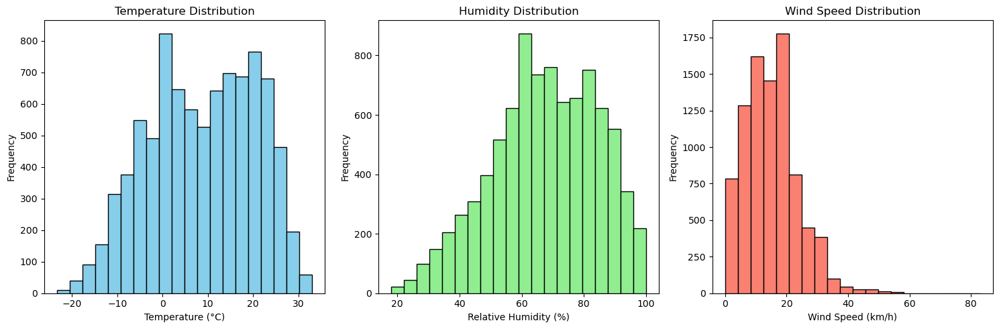

# 1. Data Overview and Cleaning
# Key Characteristics:

Dataset Size: The dataset contains 8,784 records (rows) and 8 features (columns).
Features: The dataset includes the following columns:
* Date/Time (object): The timestamp of the recorded weather data.
* Temp_C (float64): The temperature in degrees Celsius.
* Dew Point Temp_C (float64): The dew point temperature in degrees Celsius.
* Rel Hum_% (int64): The relative humidity as a percentage.
* Wind Speed_km/h (int64): The wind speed in kilometers per hour.
* Visibility_km (float64): The visibility distance in kilometers.
* Press_kPa (float64): The atmospheric pressure in kilopascals.
* Weather (object): The recorded weather conditions.

# Missing or Null Values:

There are no missing or null values in the dataset. All columns have 8,784 non-null entries. Since there are no missing values, no imputation or removal is necessary.

# Duplicate Records:

The dataset contains no duplicate records, as confirmed by the df.duplicated().sum() result showing 0 duplicates.
# 2. Statistical Summary
Numerical Features Summary:
The dataset consists of both integer and float data types, which are summarized statistically as follows:

Temperature (Temp_C):

Mean: 8.80°C
Standard Deviation: 11.69°C
Minimum: -23.3°C
Maximum: 33.0°C
Median (50th Percentile): 9.3°C

Dew Point Temperature (Dew Point Temp_C):

Mean: 2.56°C
Standard Deviation: 10.88°C
Minimum: -28.5°C
Maximum: 24.4°C
Median (50th Percentile): 3.3°C

Relative Humidity (Rel Hum_%):

Mean: 67.43%
Standard Deviation: 16.92%
Minimum: 18%
Maximum: 100%
Median (50th Percentile): 68%

Wind Speed (Wind Speed_km/h):

Mean: 14.95 km/h
Standard Deviation: 8.69 km/h
Minimum: 0 km/h
Maximum: 83 km/h
Median (50th Percentile): 13 km/h

Visibility (Visibility_km):

Mean: 27.66 km
Standard Deviation: 12.62 km
Minimum: 0.2 km
Maximum: 48.3 km
Median (50th Percentile): 25.0 km

Pressure (Press_kPa):

Mean: 101.05 kPa
Standard Deviation: 0.84 kPa
Minimum: 97.52 kPa
Maximum: 103.65 kPa
Median (50th Percentile): 101.07 kPa

# Outlier Detection:

Temperature (Temp_C):

The minimum temperature (-23.3°C) and maximum temperature (33.0°C) are significant deviations from the mean, indicating potential outliers.
Dew Point Temperature (Dew Point Temp_C):

The minimum (-28.5°C) and maximum (24.4°C) values for dew point temperature could be considered outliers due to their deviation from the mean.
Wind Speed (Wind Speed_km/h):

The maximum wind speed of 83 km/h stands out as a potential outlier, given the mean wind speed is 14.95 km/h.
Visibility (Visibility_km):

The minimum visibility of 0.2 km could indicate an outlier due to extreme weather conditions (e.g., heavy fog).
This statistical summary provides an initial understanding of the weather dataset, highlighting the central tendency and dispersion of key weather parameters. Outlier detection is crucial for identifying unusual weather events or data recording errors that may need further investigation.

# 3. DATA VISUALIZATION

The visualization provided displays three histograms representing the distributions of key weather parameters: Temperature (°C), Relative Humidity (%), and Wind Speed (km/h).

1. Temperature Distribution:
Range: The temperature ranges from approximately -25°C to 35°C.
Shape: The distribution is slightly skewed to the left, with the most frequent temperatures falling between 0°C and 10°C.
Mode: The highest frequency is observed around 0°C, indicating that temperatures close to freezing are most common in the dataset.
2. Humidity Distribution:
Range: The relative humidity values range from 20% to 100%.
Shape: The distribution is right-skewed, with a peak around 60% relative humidity, which is the most common value.
Mode: The highest frequency is seen at around 60%, suggesting that moderately humid conditions are predominant.
3. Wind Speed Distribution:
Range: Wind speed ranges from 0 km/h to about 83 km/h.
Shape: The distribution is heavily right-skewed, with the majority of wind speeds falling between 0 km/h and 20 km/h.
Mode: The most frequent wind speeds are in the range of 10-15 km/h, indicating that lower wind speeds are more common.